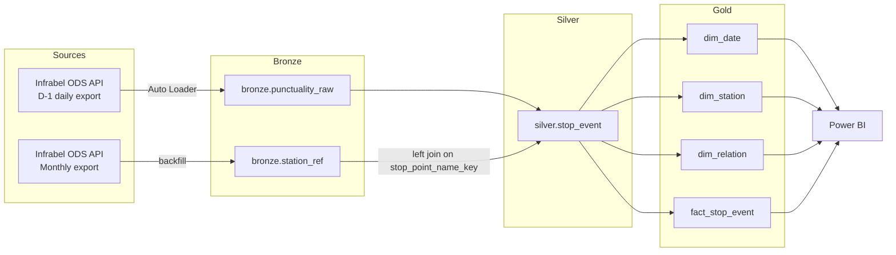
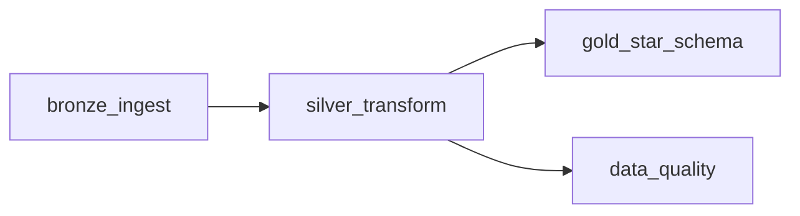
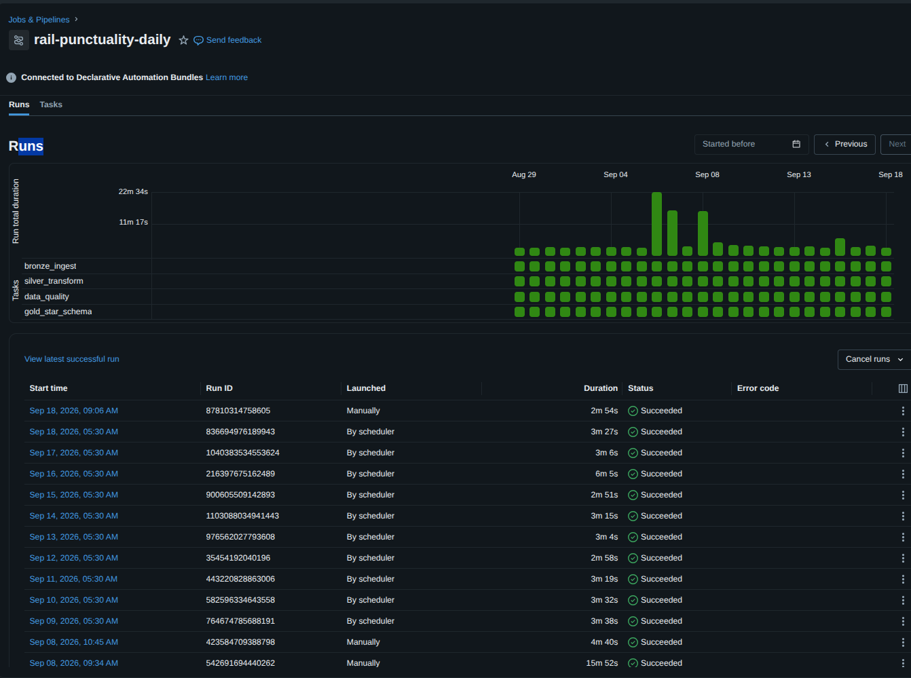

# Rail Punctuality Lakehouse 🚆


A medallion-architecture lakehouse on Databricks that ingests, cleans, and models Belgian rail punctuality data (Infrabel / SNCB open data) into a star schema for analysis in Power BI.

The pipeline is deployed and operated as a scheduled Databricks Job, version-controlled end to end with Databricks Asset Bundles. It is deliberately built to demonstrate production-oriented data engineering: incremental processing, data quality as a first-class pipeline stage, infrastructure-as-code, and testable transformation logic.

## Table of Contents

- [Overview](#overview)
- [Architecture](#architecture)
- [Data Sources](#data-sources)
- [Data Model](#data-model)
- [Pipeline Orchestration](#pipeline-orchestration)
- [Data Quality](#data-quality)
- [Repository Structure](#repository-structure)
- [Tech Stack](#tech-stack)
- [Getting Started](#getting-started)
- [Testing](#testing)
- [Roadmap](#roadmap)

## Overview

This project turns raw daily and monthly punctuality exports from Infrabel's OpenDataSoft (ODS) API into an analytics-ready star schema. It follows the Bronze → Silver → Gold medallion pattern: raw data is landed and rescued in Bronze, typed, deduplicated and conformed in Silver with data quality guarantees, and modeled into conformed dimensions and an additive fact table in Gold

Two structurally different exports feed the pipeline, and that asymmetry — the daily feed is missing the official station identifier that the monthly feed carries — drives several of the design decisions documented below. Rather than papering over it, the pipeline treats it as a first-class modeling constraint.

Everything lands in the `rail_punctuality` Unity Catalog, split across `bronze`, `silver`, `gold`, and `ops` schemas.

## Architecture



## Data Sources

The pipeline ingests two exports from the same Infrabel dataset family. Their structural difference is the single most important fact about this data, and it propagates through the whole design:

| | D-1 daily export | Monthly export |
|---|---|---|
| Cadence | Daily, previous day's data | Monthly, published with a lag |
| Write behaviour | Overwritten each morning upstream | Historical, appended |
| Contains `PTCAR_NO` (official station ID) | ❌ No | ✅ Yes |
| Role in pipeline | Primary incremental source | Station reference / backfill |

The analytical grain of this project is *one train passing one measuring point on one service date*. The measuring point is exactly what `PTCAR_NO` identifies: Infrabel's official, stable numeric ID for a point of observation on the network. It is the natural candidate for station identity, and a compact integer key would have been the ideal basis for the Silver grain.

It is not available on the incremental path. `PTCAR_NO` is carried only by the monthly export, which is published with a lag; the D-1 feed — the only source that can drive a daily pipeline — does not expose it. Anchoring station identity to that column would have made daily ingestion depend on a monthly publication cycle, which is a hard architectural constraint.

**Surrogate key for the Silver grain.** Station identity is therefore derived from a deterministic surrogate: `stop_point_key`, an MD5 hash of the normalized, accent-stripped station name. It is the `MERGE` and clustering key for `silver.stop_event`, and it is reproducible from the daily feed alone. `PTCAR_NO` is *demoted from a join dependency to a nullable enrichment attribute*, left-joined in from the monthly-derived `bronze.station_ref` crosswalk on the same normalized name.

## Data Model

**Silver** (`silver.stop_event`) — grain: *one train passing one measuring point on one service date*. Clustered with `CLUSTER BY (service_date, stop_point_key)` and upserted on the natural key `(service_date, train_no, stop_point_key)`. Delays are stored in seconds; punctuality is evaluated against Infrabel's own definition — **a train is punctual below 6 minutes** (`PUNCTUAL_THRESHOLD_S = 360`).

**Gold** — a star schema of three dimensions around one additive fact:

| Table | Grain / Key | Notes |
|---|---|---|
| `gold.dim_date` | `date_key` | Generated calendar, 2014–2027, with weekend flag |
| `gold.dim_station` | `station_key` | Station name, nullable `ptcar_no`, first/last seen, observed volume |
| `gold.dim_relation` | `relation_key` | MD5 of `relation \| direction \| operator` |
| `gold.fact_stop_event` | `date_key`, `station_key`, `relation_key` | Clustered by `(date_key, station_key)` |

`fact_stop_event` carries fully additive measures — `stop_events` and `punctual_arrivals` — so punctuality rate is a clean `SUM/SUM` ratio at any grain in the BI layer, rather than an average of averages.

## Pipeline Orchestration

The job runs daily at **05:30 Europe/Brussels** on serverless compute (Databricks Free Edition). The entire job definition lives in `resources/rail_punctuality_daily.job.yml` and is deployed via Databricks Asset Bundles. The job is `UI_LOCKED`: configuration changes go through Git and `bundle deploy`, never through manual edits in the workspace.




- **`bronze_ingest`** — fetches the D-1 export over HTTP, stages it to a Unity Catalog Volume, and incrementally ingests it into `bronze.punctuality_raw` with Auto Loader (`schemaEvolutionMode = rescue`, types left as strings by design). Configured with retries at a **1-hour interval**: long enough to ride out a transient upstream outage without burning through attempts immediately, short enough to still leave room for manual intervention within the ~23-hour window before the next scheduled run. 
- **`silver_transform`** — types, deduplicates, and enriches Bronze data, then `MERGE`s into `silver.stop_event`. On completion it publishes the run's `service_date` as a Databricks Jobs task value for downstream consumption. 
- **`gold_star_schema`** and **`data_quality`** run in parallel once Silver completes, since neither depends on the other.

Failure notifications are configured at the **job level**, so every task is covered by alerting.

## Data Quality

Data quality checks run as part of every job execution and append structured results — rows checked, rows failed, failure percentage, and pass/fail status per rule — to `ops.dq_results`. Rules are expressed as *failure conditions*, so `rows_failed == 0` means PASS:

| Layer | Check | Catches |
|---|---|---|
| Silver | `has_rows` | Empty partition — a day with zero rows |
| Silver | `not_null_keys` | Broken natural key |
| Silver | `delay_in_range` | Implausible delay values |
| Silver | `arrival_without_plan` | Actual arrival with no planned counterpart |
| Silver | `unknown_station` | Missing or empty station name |
| Bronze | `unexpected_source_columns` | Upstream schema drift, via Auto Loader's `_rescued_data` |

`has_rows` exists because the row-level checks above are all vacuously true on an empty DataFrame: zero rows means zero failures, which reads as a clean PASS. It checks partition volume directly, before the row-level rules run, and keeps the same `passed == (rows_failed == 0)` shape as every other check.

`unexpected_source_columns` turns schema drift into a signal instead of a failure. Bronze ingests with `schemaEvolutionMode = rescue`, so an unannounced upstream column lands in `_rescued_data` rather than breaking the load — this check surfaces it as data instead of letting it pass unnoticed.

`ptcar_no` completeness is tracked as a coverage metric, not a pass/fail rule. Its absence is expected on the daily feed by design (see [Data Sources](#data-sources)), so failing a check on it would produce a permanently red signal with no action attached to it.

Check definitions and evaluation logic live in `src/rail/quality.py`, separated from the notebook so they can be unit-tested with pytest without a Databricks session. The notebook handles only orchestration: reading the task value, table I/O, and the append write.

Checks are scoped to the **current run's `service_date`** rather than the full table history. `silver_transform` publishes `service_date` as a task value once its `MERGE` completes, and `data_quality` consumes it. This avoids a full-table scan and a dependency on wall-clock date assumptions — which would break on backfills, reruns, or days with no upstream data — while staying aligned with the Silver clustering key.

## Repository Structure

```
rail-punctuality-lakehouse/
├── databricks.yml                        # Asset Bundle definition (targets, sync, variables)
├── pyproject.toml                        # Package + pytest configuration
├── requirements.txt                      # Local test dependencies
├── LICENSE
├── README.md
├── resources/
│   └── rail_punctuality_daily.job.yml    # Job definition — single source of truth
├── notebooks/                            # Thin task entrypoints
│   ├── 00_setup.sql                      # Catalog, schemas, volumes
│   ├── 01_bronze_ingest.py               # D-1 fetch + Auto Loader ingest
│   ├── 01b_bronze_stop_point_reference.py# Monthly-derived station reference
│   ├── 02_silver_transform.py            # Type, dedup, enrich, MERGE
│   ├── 03_gold_star_schema.sql           # Dimensional model
│   ├── 04_data_quality.py                # DQ orchestration
│   └── 90_backfill_history.py            # Historical backfill utility
├── src/
│   └── rail/                             # Testable, importable pipeline logic
│       ├── __init__.py
│       ├── config.py                     # Catalog names, endpoints, thresholds
│       ├── transforms.py                 # Silver typing / dedup transforms
│       └── quality.py                    # DQ rule definitions + evaluation
└── tests/
    ├── conftest.py
    ├── test_transforms.py
    └── test_quality.py
```

## Tech Stack

- **Platform**: Databricks Free Edition, serverless compute
- **Storage**: Delta Lake, Unity Catalog Volumes
- **Ingestion**: Auto Loader (`cloudFiles`, rescue mode)
- **Processing**: PySpark
- **Orchestration**: Databricks Jobs + Databricks Asset Bundles (DAB)
- **Modeling**: Medallion architecture (Bronze / Silver / Gold), star schema
- **Data source**: Infrabel / SNCB via the OpenDataSoft API
- **Analytics**: Power BI *(dashboard in progress)*
- **Testing**: pytest

## Getting Started

The pipeline runs on Databricks; the local environment exists only to run the tests.

```bash
# Clone the repo
git clone https://github.com/BeatrizJover/rail-punctuality-lakehouse.git
cd rail-punctuality-lakehouse

# Local environment (tests only)
python -m venv .venv && source .venv/bin/activate
pip install -r requirements.txt

# Validate and deploy the bundle to your Databricks workspace
databricks bundle validate -t prod
databricks bundle deploy   -t prod
```

Run `notebooks/00_setup.sql` once to create the catalog, schemas, and volumes before the first
job execution.

## Environment

- **Platform**: Databricks Free Edition (serverless compute, environment version 5)
- **Python (Databricks)**: 3.12.3
- **Local development**: Python 3.12.13 in a virtual environment (tests only)

## Testing

Tests run with `pytest` and use explicit `StructType` schemas (defined in `tests/conftest.py`) to match the all-string schema of the real source data, rather than relying on PySpark's type inference from Python literals.

Coverage focuses on the logic most likely to break silently: the Infrabel punctuality threshold, early arrivals (negative delays are valid, not errors), deduplication keeping the latest ingestion, and rows with no natural key being dropped.

```bash
pytest tests/
```

## Dashboard

*Power BI dashboard in progress — screenshot and report notes to follow.*

## Roadmap

| Module / Layer | Primary Objective | Status | Priority |
| :--- | :--- | :---: | :---: |
| **Bronze Layer** | Structural content validation (`raise_for_status()`) & empty response handling | ⏳ Pending | High |
| **Silver Layer** | Blank station name filtering & bounded compute window (last N days) | ⏳ Pending | Medium |
| **Data Quality** | Freshness validation (`max(service_date)`) & decoupled historical audit job | ⏳ Pending | Medium |
| **Gold Layer** | Incremental `MERGE` migration for `fact_stop_event` | ✅ Done | — |
| **Gold Layer** | Deterministic `ptcar_no` tie-breaker in station reference crosswalk | ⏳ Pending | High |
| **Maintenance** | Retention policy scheduling (`VACUUM`) & multi-year backfill support | 💡 Idea | Low |

## Author

**Beatriz Cruz Jover**
[github.com/BeatrizJover](https://github.com/BeatrizJover)

## License

MIT — see [LICENSE](LICENSE).
