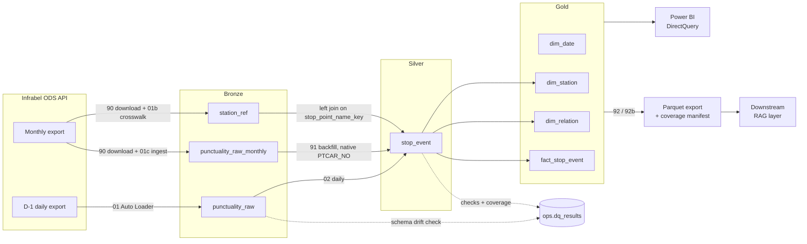
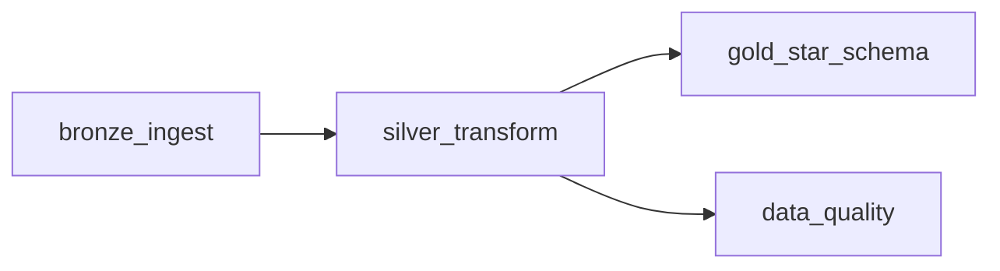

# Rail Punctuality Lakehouse 🚆


[](https://github.com/BeatrizJover/rail-punctuality-lakehouse/actions/workflows/ci.yml)

A medallion-architecture lakehouse on Databricks that ingests Belgian rail punctuality open data (Infrabel), reconciles two structurally different exports, and models them into an incrementally maintained star schema for analysis in Power BI and for a downstream [question-answering layer](https://github.com/BeatrizJover/rail-punctuality-rag).

The pipeline runs as a scheduled Databricks Job, deployed end to end with Databricks Asset Bundles. It is built around production concerns: incremental processing, idempotent reruns and backfills, data quality recorded as data, and transformation logic that is unit-tested outside Databricks.

## Architecture



Solid edges carry data; dotted edges carry observations about it. Edge labels reference the notebook that performs the step. `dim_date` is a generated calendar with no upstream dependency.

## Table of Contents

- [Problem Statement](#problem-statement)
- [Project at a Glance](#project-at-a-glance)
- [Key Design Decisions](#key-design-decisions)
- [Data Sources](#data-sources)
- [Schema Governance](#schema-governance)
- [Data Model](#data-model)
- [Pipeline Orchestration](#pipeline-orchestration)
- [Data Quality](#data-quality)
- [Consumption](#consumption)
- [Repository Structure](#repository-structure)
- [Tech Stack](#tech-stack)
- [Getting Started](#getting-started)
- [Environment](#environment)
- [Testing](#testing)
- [Dashboard](#dashboard)
- [Roadmap](#roadmap)

## Problem Statement

Infrabel publishes raw punctuality records for every train at every measuring point on the Belgian network. The public traveller portal answers *"is my train late right now?"*. This project answers a different question for a different audience — network and operations planners looking at history: **where, when and on which relations does delay originate, and does it grow or recover along the route?**

The Gold model is designed to answer questions such as:

- Which measuring points concentrate late arrivals, and is that pattern stable across months?
- How does punctuality vary by hour of day and between weekdays and weekends?
- Which relations and operators under-perform once results are weighted by traffic volume?
- Where do trains lose or recover time while stopped (`dwell_delta_s`)?

The data was not prepared for analysis. The two exports differ in delimiter, date format and station identifier; the daily file is overwritten upstream every morning; station names carry inconsistent accents and spacing. Most of the engineering in this repository exists to absorb those properties explicitly rather than hide them.

## Project at a Glance

| | |
|---|---|
| **Data** | Infrabel raw punctuality — one row per train per measuring point per service date |
| **History loaded** | January 2024 onward — monthly backfill for closed months, daily feed for the current one |
| **Volume** | ~61M rows in `gold.fact_stop_event`, across 701 measuring points and 566 relations; ~2M rows / ~300 MB per monthly file; ~75k rows per weekday and ~45k per weekend day from the daily feed |
| **Cadence** | Daily at 07:00 Europe/Brussels; monthly backfill on demand, one year per run |
| **Daily runtime** | ~3 minutes end to end |
| **Compute** | Databricks Free Edition — serverless jobs compute and a SQL Warehouse |
| **Deployment** | Databricks Asset Bundles; job definition versioned in Git |
| **Consumers** | Power BI (DirectQuery); date-partitioned Parquet export for [rail-punctuality-rag](https://github.com/BeatrizJover/rail-punctuality-rag) |
| **Quality gates** | 14 pytest unit tests and ruff on every push (GitHub Actions); 6 data quality rules per scheduled run |

## Key Design Decisions

Each decision below is detailed in the linked section.

| Decision | Alternative considered | Rationale |
|---|---|---|
| Station identity from an MD5 of the normalized name (`stop_point_key`) — [Data Sources](#data-sources) | `PTCAR_NO`, Infrabel's official station ID | Absent from the daily feed; keying on it would make daily ingestion wait for the monthly publication |
| Explicit *monthly-wins* `MERGE` condition — [Data Model](#data-model) | Last write wins, by arrival order | Overlapping feeds converge to the same state regardless of run order |
| Rescue mode for daily, declared contract for monthly — [Schema Governance](#schema-governance) | One schema policy for both feeds | A daily load must not stop on a new upstream column; a backfill must not load a file it was not built for |
| Gold maintained by `MERGE` scoped to one `service_date` — [Pipeline Orchestration](#pipeline-orchestration) | `CREATE OR REPLACE` from a full Silver scan | Daily runtime stays flat as history grows |
| `least` / `greatest` / `coalesce` in dimension merges — [Data Model](#data-model) | Recomputed attributes and stored counts | Idempotent under reruns, correct under out-of-order backfills |
| Additive fact measures (`stop_events`, `punctual_arrivals`) — [Data Model](#data-model) | Pre-computed rates | Punctuality is `SUM / SUM` at any grain, never an average of averages |
| Rule outcomes appended to `ops.dq_results` — [Data Quality](#data-quality) | Checks that only log or raise | Quality becomes queryable history rather than a transient log line |
| Fail the run on a stale D-1 export — [Pipeline Orchestration](#pipeline-orchestration) | Land whatever the fetch returned | A file that silently holds the previous service date is worse than a failed task the retry policy can recover from |
| Power BI in DirectQuery — [Consumption](#consumption) | Import mode | The warehouse stays the single source of truth for ~61M growing rows, with no dataset refresh to keep in sync with the job; iterator-heavy DAX is deferred |
| Parquet export with a producer-owned manifest — [Consumption](#consumption) | Consumers query Databricks directly | Credential-free, transport-independent interface for downstream projects |

## Data Sources

The pipeline ingests two exports from the same Infrabel dataset family. Their structural difference is the single most important fact about this data, and it propagates through the whole design:

| | D-1 daily export | Monthly export |
|---|---|---|
| Cadence | Daily, previous day's data | Monthly, published with a lag |
| Write behaviour | Overwritten each morning upstream | Historical, appended |
| Publication timing | Refreshed around 06:00 Europe/Brussels, with day-to-day variation | Published weeks after the month closes |
| Delimiter | `;` — requested from the export API | `,` — fixed property of the published file |
| Date literals | ISO (`2026-07-01`) | SAS-style (`01JUL2026`) |
| Contains `PTCAR_NO` (official station ID) | ❌ No | ✅ Yes |
| Role in pipeline | Primary incremental source | Station crosswalk, plus historical backfill of Silver and Gold |
| Entrypoint | `01_bronze_ingest.py` (scheduled) | `90` → `01c` → `91`, and `90` → `01b` (ad-hoc) |

The two feeds are not interchangeable at the file level: the delimiter and the date format differ, so `CSV_SEP` and `MONTHLY_CSV_SEP` are separate constants and `normalize_monthly_dates()` rewrites the monthly literals to ISO on ingest. From Silver's point of view there is then a single input contract.

The analytical grain of this project is *one train passing one measuring point on one service date*. The measuring point is exactly what `PTCAR_NO` identifies: Infrabel's official, stable numeric ID for a point of observation on the network. It is the natural candidate for station identity, and a compact integer key would have been the ideal basis for the Silver grain.

It is not available on the incremental path. `PTCAR_NO` is carried only by the monthly export, which is published with a lag; the D-1 feed — the only source that can drive a daily pipeline — does not expose it. Anchoring station identity to that column would have made daily ingestion depend on a monthly publication cycle, which is a hard architectural constraint.

**Surrogate key for the Silver grain.** Station identity is therefore derived from a deterministic surrogate: `stop_point_key`, an MD5 hash of the normalized, accent-stripped station name. It is the `MERGE` and clustering key for `silver.stop_event`, and it is reproducible from the daily feed alone. `PTCAR_NO` is *demoted from a join dependency to a nullable enrichment attribute*: read natively when the row comes from the monthly export (`with_native_ptcar=True`), and otherwise left-joined in from the monthly-derived `bronze.station_ref` crosswalk on the same normalized name, with `coalesce(native, crosswalk)` deciding.

## Schema Governance

The two feeds are governed differently, because their failure modes differ.

**Daily — tolerate and record.** Bronze ingests the D-1 export with Auto Loader in `schemaEvolutionMode = rescue` and `inferColumnTypes = false`. An unannounced upstream column lands in `_rescued_data` instead of breaking the load; the `unexpected_source_columns` rule then surfaces it. The daily pipeline must not stop because Infrabel added a field.

**Monthly — declare and fail loud.** `01c_bronze_monthly_ingest.py` carries an explicit `SOURCE_COLUMNS` list of the fields the pipeline consumes, and enforces it per file:

- a **missing** required column raises — the file is not what the pipeline was built against;
- an **unexpected** extra column is logged and ignored — it is not in the contract, so it is not silently carried;
- an **unparseable date literal** raises before any write, so a file using non-English month abbreviations can never be normalized to NULL dates unnoticed (`count_unparsed_dates()`).

Adding a monthly column therefore means editing `SOURCE_COLUMNS`, adding it to the target DDL, and re-ingesting the affected months — which is safe, because `bronze.punctuality_raw_monthly` is partitioned by `source_year_month` and written with `replaceWhere`. **The month is the unit of idempotency: re-ingesting a month replaces it.**

## Data Model

**Silver** (`silver.stop_event`) — grain: *one train passing one measuring point on one service date*. Clustered with `CLUSTER BY (service_date, stop_point_key)` and upserted on the natural key `(service_date, train_no, stop_point_key)`. Every row carries `source_feed`, the label of the export it came from. Delays are stored in seconds, and four metrics are derived at this layer:

| Column | Definition |
|---|---|
| `is_punctual_arr` | `delay_arr_s < 360` — Infrabel's own definition: **a train is punctual below 6 minutes** (`PUNCTUAL_THRESHOLD_S`). Negative delays (early arrivals) are valid data and count as punctual. |
| `delay_arr_min` | Arrival delay in minutes, rounded to one decimal |
| `dwell_delta_s` | `delay_dep_s − delay_arr_s`. Positive: the train lost time at the measuring point. Negative: it recovered time. This turns a per-stop snapshot into a signal of where delay is created along a route. |
| `planned_hour` | Hour of the planned arrival, for time-of-day analysis |

**The monthly-wins rule.** The two feeds overlap: once a month is published it covers service dates the daily feed already loaded, and it carries `PTCAR_NO` where the daily rows do not. Both paths `MERGE` on the same natural key, so the tie is broken explicitly rather than by arrival order:

```python
.whenMatchedUpdateAll(
    condition="t.source_feed = 'daily' OR s.source_feed = 'monthly'"
)
```

A monthly row always overwrites; a daily row overwrites only another daily row. The result is order-independent — a backfill can run before or after the day it covers and converge to the same state — and a later daily rerun can never strip a `PTCAR_NO` the monthly feed already supplied.

**Gold** — a star schema of three dimensions around one additive fact:

| Table | Key | Notes |
|---|---|---|
| `gold.dim_date` | `date_key` | Generated calendar, 2014–2027, with weekend flag |
| `gold.dim_station` | `station_key` | Station name, nullable `ptcar_no`, and `first_seen` / `last_seen` maintained as idempotent accumulators |
| `gold.dim_relation` | `relation_key` | MD5 of `relation \| direction \| operator` |
| `gold.fact_stop_event` | `date_key`, `station_key`, `train_no` | Grain key and `MERGE` predicate. Clustered by `(date_key, station_key)` |

`relation_key` is a foreign key on the fact, not part of its grain: it is functionally determined by the train's relation and adds no uniqueness to `(date_key, station_key, train_no)` — the same triple as the Silver natural key.

`fact_stop_event` carries fully additive measures — `stop_events` and `punctual_arrivals` — so punctuality rate is a clean `SUM / SUM` ratio at any grain in the BI layer, rather than an average of averages.

**Dimensions maintained incrementally.** All three dimensions are updated by `MERGE` scoped to the current run's `service_date`, never rebuilt from a full Silver scan. Two modeling decisions make this safe:

- **No fact-derived measures in a dimension.** `dim_station` deliberately carries no stored stop-event count. A `count(*)` of fact rows cannot be maintained incrementally — adding the day's batch double-counts on any repair run, and computing it exactly requires the full Silver scan the incremental design removes. It belongs in the BI layer as `SUM(stop_events)` over `fact_stop_event`, which respects the report's date filters, where a static column would not. The one-shot `00_migration_dim_station_reseed.sql` removed the former column.
- **Idempotent accumulators over additive ones.** `first_seen` and `last_seen` are merged with `least()` / `greatest()` rather than recomputed. This is idempotent under reruns and self-correcting when a historical year is backfilled *after* a more recent one. `station_name` and `ptcar_no` use `coalesce(source, target)`, so a NULL `PTCAR_NO` from the daily feed never erases a value already known from the monthly feed — applying the monthly-wins rule to the dimension as well.

## Pipeline Orchestration

### Scheduled job

The job runs daily at **07:00 Europe/Brussels** on serverless compute (Databricks Free Edition). Its entire definition lives in `resources/rail_punctuality_daily.job.yml` and is deployed via Databricks Asset Bundles: configuration changes go through Git and `bundle deploy`, never through manual edits in the workspace.




- **`bronze_ingest`** — fetches the D-1 export over HTTP, validates that it actually covers the expected service date, stages it to a Unity Catalog Volume, and incrementally ingests it into `bronze.punctuality_raw` with Auto Loader. Retries run at a **1-hour interval**: long enough for a late upstream publication to land without burning through attempts immediately, short enough to leave room for manual intervention within the ~23-hour window before the next scheduled run.
- **`silver_transform`** — types, deduplicates, and enriches Bronze data, then `MERGE`s into `silver.stop_event` under the monthly-wins rule. On completion it publishes the run's `service_date` as a Databricks Jobs task value.
- **`gold_star_schema`** and **`data_quality`** run in parallel once Silver completes, since neither depends on the other. Both consume the `service_date` task value — Gold receives it as a SQL task parameter and binds it to a session variable. `dim_date` is a static calendar created once; the dimensions are upserted by `MERGE` scoped to the run's `service_date`, and the fact is `MERGE`d for the same date with the target pruned on `date_key`. No statement in the task scans Silver in full.

Failure notifications are configured at the **job level**, so every task is covered by alerting.

**Upstream refresh timing.** The schedule originally ran at 05:30, before Infrabel's refresh of the D-1 export. The fetch then returned the *previous* service date, and it was landed under a file named after the expected one — so the pipeline looked healthy while running a day behind, and the days the upstream published early produced no new rows at all. The Delta history of `silver.stop_event` made the pattern visible: runs at 05:30 inserted a weekend-sized batch on Mondays and Tuesdays, and occasionally inserted nothing.

Three changes close the gap, and the bug drove all three:

- the schedule moved to **07:00**, after the observed refresh;
- `validate_d1_export()` in `src/rail/ingest.py` compares the payload's own `DATDEP` against the expected service date and raises `StaleExportError` before anything is written, so the retry policy waits for a late publication instead of ingesting stale data;
- landed files carry the fetch timestamp (`YYYY-MM-DD_YYYYMMDDTHHMMSSZ.csv`), because Auto Loader skips a path it has already processed and a retry writing to the same name would never be ingested.

Service dates missed while this was in place are recovered by the monthly backfill path, which is exactly what it exists for.

### Backfill and publishing (ad-hoc)

The monthly path is deliberately not on the schedule: the files are ~2M rows each, they are published with a lag, and re-running them is a repair operation rather than a daily one. Each notebook is run by hand, one year at a time, and validates its parameters before doing any work.

| Notebook | Reads | Writes | Parameters | Runs after |
|---|---|---|---|---|
| `90_backfill_history.py` | ODS monthly dataset catalog | `landing/monthly/*.csv` | `BACKFILL_YEAR`, `BACKFILL_MONTHS` constants | — |
| `01c_bronze_monthly_ingest.py` | Landed monthly CSVs | `bronze.punctuality_raw_monthly` | `year`, `months` widgets | `90` |
| `91_backfill_silver_gold.py` | `bronze.punctuality_raw_monthly` | `silver.stop_event`, Gold fact and dimensions | `year` widget | `01c` |
| `01b_bronze_stop_point_reference.py` | One landed monthly CSV | `bronze.station_ref` | `YEAR`, `MONTH` constants | `90` |
| `92b_export_gold_local.py` | Gold | Parquet export on a UC Volume | `start_year`, `end_year`, `export_root` widgets | `91` or the daily job |
| `92_export_gold_to_blob.py` | Gold | Parquet export on Azure Blob | `start_year`, `end_year`, storage and secret widgets | `91` or the daily job |

Files prefixed `00_migration_` are run once, manually, before deploying the change they support. They are not part of the scheduled job.

## Data Quality

Data quality runs as part of every scheduled execution and appends structured results — rows checked, rows failed, failure percentage, and verdict per rule — to `ops.dq_results`. Rules are expressed as *failure conditions*, so `rows_failed == 0` means PASS:

| Layer | Rule | Catches / measures | Scope |
|---|---|---|---|
| Silver | `not_null_keys` | Broken natural key | Run's `service_date` |
| Silver | `delay_in_range` | Implausible delay values | Run's `service_date` |
| Silver | `arrival_without_plan` | Actual arrival with no planned counterpart | Run's `service_date` |
| Silver | `unknown_station` | Missing or empty station name | Run's `service_date` |
| Silver | `ptcar_no_coverage` | Rows still missing the official station ID | Run's `service_date` |
| Bronze | `unexpected_source_columns` | Upstream schema drift, via Auto Loader's `_rescued_data` | Full table |

`unexpected_source_columns` turns schema drift into a signal instead of a failure. Bronze ingests with `schemaEvolutionMode = rescue`, so an unannounced upstream column lands in `_rescued_data` rather than breaking the load — this rule surfaces it as data instead of letting it pass unnoticed.

**`ptcar_no_coverage` is a metric, not an alert.** It is defined in `SILVER_COVERAGE`, separate from the assertions in `SILVER_CHECKS`, and is read through `pct_failed` — the share of the day's rows still missing `PTCAR_NO`, which should fall as monthly backfills land. Its absence on the daily feed is expected by design (see [Data Sources](#data-sources)), so its `passed` value carries no operational meaning and should not be alerted on.

**Scoping.** The Silver rules are scoped to the **current run's `service_date`** rather than the full table history. `silver_transform` publishes `service_date` as a task value once its `MERGE` completes, and `data_quality` consumes it. This avoids a full-table scan and a dependency on wall-clock date assumptions — which would break on backfills, reruns, or days with no upstream data — while staying aligned with the Silver clustering key. The Bronze rule is not scoped: schema drift is a property of the ingested file rather than of a service date, and a rescued row may carry no parseable date to filter on.

**Current boundaries.** Rules are observational: a failed rule is recorded, not raised, so job-level alerting covers execution errors but not rule violations. Dates written by the backfill path (`91`) are not evaluated by the scheduled task. Both gaps are tracked on the [Roadmap](#roadmap).

Rule definitions and evaluation logic live in `src/rail/quality.py`, separated from the notebook so they can be unit-tested with pytest without a Databricks session. The notebook handles only orchestration: reading the task value, table I/O, and the append write.

## Consumption

### Power BI

The report connects to the Databricks SQL Warehouse in **DirectQuery** mode over the Gold star schema, with relationships from `fact_stop_event` to the three dimensions. Measures are built on the additive columns — punctuality rate is `DIVIDE(SUM(punctual_arrivals), SUM(stop_events))`, never an average of per-row flags.

DirectQuery is a deliberate trade-off. The fact table holds ~61M rows and grows daily, so Databricks stays the single source of truth and there is no dataset refresh to keep in sync with the job. The cost is that every visual issues SQL against the warehouse, including a cold start when serverless has scaled to zero, so iterator-heavy DAX such as `PERCENTILEX.INC` (P90 delay) is deferred rather than silently approximated. If interaction latency becomes the binding constraint, the next step is a pre-aggregated Gold table consumed in Import mode, not a switch of the whole model.

### Published Gold export

`92b_export_gold_local.py` publishes Gold as date-partitioned Parquet together with a producer-written coverage manifest. The layout is a contract: [rail-punctuality-rag](https://github.com/BeatrizJover/rail-punctuality-rag) mirrors it verbatim, so changing it is a breaking change.

```
gold/
├── fact_stop_event/date_key=YYYY-MM-DD/*.parquet
├── dim_date/*.parquet
├── dim_station/*.parquet
├── dim_relation/*.parquet
└── _manifest/coverage.json
```

- **Transport-independent.** `92b` writes to a Unity Catalog Volume and is the transport in use; `92_export_gold_to_blob.py` writes the identical layout to Azure Blob over ABFS, with a SAS token read from a Databricks secret scope — implemented, but the storage account and secret scope are not configured yet. Switching transports changes only the root path.
- **Idempotent.** The fact is written with dynamic partition overwrite, so re-exporting a range rewrites only its date partitions; dimensions are small and overwritten whole.
- **Fail fast on an empty window.** An export that published nothing would hand the consumer a valid-looking but empty contract, so the notebook raises instead.
- **Coverage owned by the producer.** The manifest records the requested range, the actual `date_key` bounds, rows per year and dimension sizes, so the consumer can state its limits instead of returning silent empty results outside the window.
- **Verified from the consumer's side.** The published schema is read back with PyArrow as well as Spark: Hive partition keys are not stored in the files, so the type of `date_key` is whatever the reader infers. Nullability is profiled against real data rather than taken from the DDL.

## Repository Structure

```
rail-punctuality-lakehouse/
├── .github/
│   └── workflows/
│       └── ci.yml                             # pytest + ruff on push and pull request
├── databricks.yml                             # Asset Bundle definition (targets, sync, variables)
├── pyproject.toml                             # Package + pytest + ruff configuration
├── requirements.txt                           # Local test dependencies
├── LICENSE
├── README.md
├── docs/
│   └── img/                                   # Screenshots referenced by this README
├── resources/
│   └── rail_punctuality_daily.job.yml         # Job definition — single source of truth
├── notebooks/                                 # Thin task entrypoints
│   ├── 00_setup.sql                           # Catalog, schemas, volumes
│   ├── 00_migration_dim_station_reseed.sql    # One-shot: drop the fact-derived column
│   ├── 00_migration_silver_source_feed.sql    # One-shot: add and backfill source_feed
│   ├── 01_bronze_ingest.py                    # D-1 fetch + Auto Loader ingest        [scheduled]
│   ├── 01b_bronze_stop_point_reference.py     # Monthly-derived station crosswalk     [ad-hoc]
│   ├── 01c_bronze_monthly_ingest.py           # Monthly export ingest, one year/run   [ad-hoc]
│   ├── 02_silver_transform.py                 # Type, dedup, enrich, MERGE            [scheduled]
│   ├── 03_gold_star_schema.sql                # Incremental dimensional model         [scheduled]
│   ├── 04_data_quality.py                     # DQ orchestration                      [scheduled]
│   ├── 90_backfill_history.py                 # Monthly file download utility         [ad-hoc]
│   ├── 91_backfill_silver_gold.py             # Silver + Gold backfill, one year/run  [ad-hoc]
│   ├── 92_export_gold_to_blob.py              # Gold → Parquet contract on Azure Blob [ad-hoc]
│   └── 92b_export_gold_local.py               # Gold → Parquet contract on UC Volume  [ad-hoc]
├── src/
│   └── rail/                                  # Testable, importable pipeline logic
│       ├── __init__.py
│       ├── config.py                          # Catalog names, endpoints, thresholds
│       ├── ingest.py                           # D-1 export validation (stale / empty payloads)
│       ├── transforms.py                      # Silver typing / dedup / date normalization
│       └── quality.py                         # DQ rule definitions + evaluation
└── tests/
    ├── conftest.py
    ├── test_ingest.py
    ├── test_transforms.py
    └── test_quality.py
```

Notebooks stay thin: anything with logic worth testing lives in `src/rail/` and is imported.

## Tech Stack

- **Platform**: Databricks Free Edition, serverless compute, Databricks SQL Warehouse
- **Storage**: Delta Lake (liquid clustering, Predictive Optimization), Unity Catalog Volumes
- **Ingestion**: Auto Loader (`cloudFiles`, rescue mode) for daily; declared-schema batch reads for monthly
- **Processing**: PySpark, Spark SQL
- **Orchestration**: Databricks Jobs + Databricks Asset Bundles (DAB)
- **Modeling**: Medallion architecture (Bronze / Silver / Gold), star schema
- **Publishing**: Parquet on Unity Catalog Volumes / Azure Blob (ABFS), PyArrow for contract verification
- **Data source**: Infrabel / SNCB via the OpenDataSoft API
- **Analytics**: Power BI Service, DirectQuery *(report in progress)*
- **Testing / CI**: pytest, ruff, GitHub Actions

## Getting Started

The pipeline runs on Databricks; the local environment exists only to run tests and lint.

```bash
# Clone the repo
git clone https://github.com/BeatrizJover/rail-punctuality-lakehouse.git
cd rail-punctuality-lakehouse

# Local environment (tests and lint only; PySpark needs a JDK 17 on PATH)
python -m venv .venv && source .venv/bin/activate
pip install -r requirements.txt
pytest -q
ruff check .

# Validate and deploy the bundle to your Databricks workspace
databricks bundle validate -t prod
databricks bundle deploy   -t prod
```

Workspace setup:

1. Run `notebooks/00_setup.sql` once to create the catalog, schemas, and volumes before the first job execution.
2. Set `warehouse_id` in `resources/rail_punctuality_daily.job.yml` to a SQL Warehouse in your workspace — the Gold task runs there.
3. *(Optional)* Load history with the [backfill path](#backfill-and-publishing-ad-hoc), one year at a time.
4. *(Optional)* Create the export volume listed in the header of `92b_export_gold_local.py` before publishing Gold.

## Environment

- **Platform**: Databricks Free Edition (serverless compute, environment version 5)
- **Python (Databricks)**: 3.12.3
- **Local development**: Python 3.12.13 in a virtual environment (tests only)

## Testing

Tests run with `pytest` and use explicit `StructType` schemas (defined in `tests/conftest.py`) to match the all-string schema of the real source data, rather than relying on PySpark's type inference from Python literals.

Coverage focuses on the logic most likely to break silently:

- the Infrabel punctuality threshold, and early arrivals — negative delays are valid data, not errors;
- deduplication keeping the latest ingestion, and rows with no natural key being dropped;
- monthly date literals normalizing to ISO, NULL planned dates surviving that normalization, and a non-English month abbreviation being counted rather than silently nulled;
- `source_feed` labelling every row, and `PTCAR_NO` being read natively only on the monthly path;
- the D-1 export guard: a payload holding the previous service date, an empty payload, and a payload with no `DATDEP` column all raise before anything is landed;
- the DQ evaluator's accounting: rows checked, rows failed, and the verdict.

The `ingest` tests are pure Python and need no Spark session; the rest use a local session and therefore a JDK.

```bash
pytest -q
ruff check .
```

Both commands run on every push to `main` and on every pull request via `.github/workflows/ci.yml`, on Python 3.12 with a Temurin JDK 17.

## Dashboard

*Power BI report in progress — four pages planned: Network Health, By Station, By Relation / Operator, and Temporal Analysis. Screenshots and report notes to follow.*

## Roadmap

| Module / Layer | Primary Objective | Status | Priority |
| :--- | :--- | :---: | :---: |
| **Bronze Layer** | D-1 fetch guard — reject stale or empty exports before landing, and name landed files by fetch timestamp | ✅ Done | — |
| **Bronze Layer** | Station crosswalk (`01b`): build from `bronze.punctuality_raw_monthly` across all loaded months, with a deterministic `ptcar_no` tie-breaker — it currently reads a single configured month and keeps `first()` | ⏳ Pending | High |
| **Silver Layer** | Bounded Bronze read window — each daily run re-reads the full daily Bronze table and rewrites every daily Silver row (≈2.06M source rows on 2026-09-17, growing ~75k per day); plus blank station name filtering | ⏳ Pending | High |
| **Data Quality** | Empty-partition rule — row-level checks read as PASS on a day with zero rows | ⏳ Pending | High |
| **Data Quality** | Alert on failed assertions — outcomes are recorded, not enforced | ⏳ Pending | Medium |
| **Data Quality** | Decouple the coverage verdict from the assertion verdict in `ops.dq_results` | ⏳ Pending | Medium |
| **Data Quality** | Freshness validation (`max(service_date)`) & historical audit job covering backfilled dates — the Bronze guard covers the daily fetch, Silver-level freshness is still open | ⏳ Pending | Medium |
| **Data Quality** | Bound the Bronze schema-drift check to the current ingestion batch | ⏳ Pending | Low |
| **Gold Layer** | Incremental `MERGE` for `fact_stop_event` and all dimensions — no full Silver scan | ✅ Done | — |
| **Gold Layer** | Extend `dim_date` beyond 2027-12-31 — it is generated once with `CREATE TABLE IF NOT EXISTS` | ⏳ Pending | Medium |
| **Backfill** | Year-scoped monthly ingest and Silver / Gold backfill (`01c`, `91`) | ✅ Done | — |
| **Backfill** | Replace configuration constants in `90` and `01b` with validated widgets | ⏳ Pending | Low |
| **Publishing** | Date-partitioned Gold Parquet export with coverage manifest | ✅ Done | — |
| **Publishing** | Azure Blob transport (`92`) — implemented; storage account and secret scope not configured | ⏳ Pending | Low |
| **Platform** | Environment isolation — the catalog name is hard-coded in `config.py`, the SQL notebooks and several Python notebooks, and the bundle's `catalog` / `schema` variables are declared but not consumed, so `dev` and `prod` targets write to the same catalog | ⏳ Pending | Medium |
| **Platform** | CI: pytest and ruff on every push via GitHub Actions | ✅ Done | — |
| **Analytics** | Power BI report, four pages | 🚧 In progress | High |
| **Maintenance** | File compaction and retention (`OPTIMIZE`, `VACUUM`) — delegated to Databricks Predictive Optimization on Unity Catalog managed tables | ✅ Platform-managed | — |

## Author

**Beatriz Cruz Jover**
[github.com/BeatrizJover](https://github.com/BeatrizJover)

## License

MIT — see [LICENSE](LICENSE).
