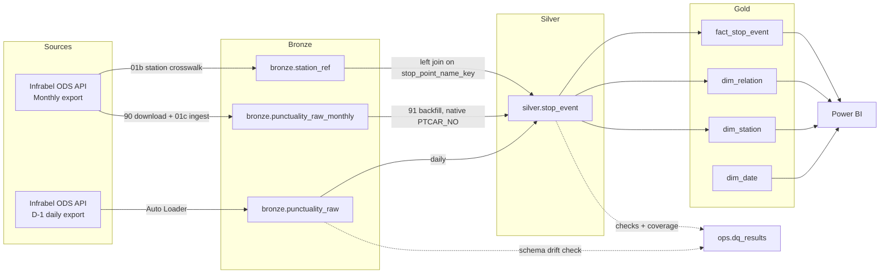
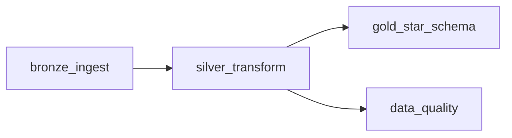

# Rail Punctuality Lakehouse 🚆


A medallion-architecture lakehouse on Databricks that ingests, cleans, and models Belgian rail punctuality data (Infrabel / SNCB open data) into a star schema for analysis in Power BI.

The pipeline is deployed and operated as a scheduled Databricks Job, version-controlled end to end with Databricks Asset Bundles. It is deliberately built to demonstrate production-oriented data engineering: incremental processing, data quality as a first-class pipeline stage, infrastructure-as-code, and testable transformation logic.

## Table of Contents

- [Overview](#overview)
- [Architecture](#architecture)
- [Data Sources](#data-sources)
- [Schema Governance](#schema-governance)
- [Data Model](#data-model)
- [Pipeline Orchestration](#pipeline-orchestration)
- [Data Quality](#data-quality)
- [Repository Structure](#repository-structure)
- [Tech Stack](#tech-stack)
- [Getting Started](#getting-started)
- [Environment](#environment)
- [Testing](#testing)
- [Dashboard](#dashboard)
- [Roadmap](#roadmap)

## Overview

This project turns raw daily and monthly punctuality exports from Infrabel's OpenDataSoft (ODS) API into an analytics-ready star schema. It follows the Bronze → Silver → Gold medallion pattern: raw data is landed and rescued in Bronze, typed, deduplicated and conformed in Silver with data quality checks, and modeled into conformed dimensions and an additive fact table in Gold.

Two structurally different exports feed the pipeline, and that asymmetry — the daily feed is missing the official station identifier that the monthly feed carries — drives several of the design decisions documented below. Rather than papering over it, the pipeline treats it as a first-class modeling constraint.

Everything lands in the `rail_punctuality` Unity Catalog, split across `bronze`, `silver`, `gold`, and `ops` schemas.

## Architecture



`dim_date` is a generated calendar with no upstream dependency, so it has no inbound edge from Silver. Solid edges carry data; dotted edges carry observations about it.

## Data Sources

The pipeline ingests two exports from the same Infrabel dataset family. Their structural difference is the single most important fact about this data, and it propagates through the whole design:

| | D-1 daily export | Monthly export |
|---|---|---|
| Cadence | Daily, previous day's data | Monthly, published with a lag |
| Write behaviour | Overwritten each morning upstream | Historical, appended |
| Delimiter | `;` — requested from the export API | `,` — fixed property of the published file |
| Date literals | ISO (`2026-07-01`) | SAS-style (`01JUL2026`) |
| Contains `PTCAR_NO` (official station ID) | ❌ No | ✅ Yes |
| Role in pipeline | Primary incremental source | Station crosswalk, plus historical backfill of Silver and Gold |
| Entrypoint | `01_bronze_ingest.py` (scheduled) | `90` → `01c` → `01b` / `91` (ad-hoc) |

The two feeds are not interchangeable at the file level: the delimiter and the date format differ, so `CSV_SEP` and `MONTHLY_CSV_SEP` are separate constants and `normalize_monthly_dates()` rewrites the monthly literals to ISO on ingest. From Silver's point of view there is then a single input contract.

The analytical grain of this project is *one train passing one measuring point on one service date*. The measuring point is exactly what `PTCAR_NO` identifies: Infrabel's official, stable numeric ID for a point of observation on the network. It is the natural candidate for station identity, and a compact integer key would have been the ideal basis for the Silver grain.

It is not available on the incremental path. `PTCAR_NO` is carried only by the monthly export, which is published with a lag; the D-1 feed — the only source that can drive a daily pipeline — does not expose it. Anchoring station identity to that column would have made daily ingestion depend on a monthly publication cycle, which is a hard architectural constraint.

**Surrogate key for the Silver grain.** Station identity is therefore derived from a deterministic surrogate: `stop_point_key`, an MD5 hash of the normalized, accent-stripped station name. It is the `MERGE` and clustering key for `silver.stop_event`, and it is reproducible from the daily feed alone. `PTCAR_NO` is *demoted from a join dependency to a nullable enrichment attribute*: read natively when the row comes from the monthly export (`with_native_ptcar=True`), and otherwise left-joined in from the monthly-derived `bronze.station_ref` crosswalk on the same normalized name, with `coalesce(native, crosswalk)` deciding.

## Schema Governance

The two feeds are governed differently, because their failure modes differ.

**Daily — tolerate and record.** Bronze ingests the D-1 export with Auto Loader in `schemaEvolutionMode = rescue` and `inferColumnTypes = false`. An unannounced upstream column lands in `_rescued_data` instead of breaking the load; the `unexpected_source_columns` check then surfaces it. The daily pipeline must not stop because Infrabel added a field.

**Monthly — declare and fail loud.** `01c_bronze_monthly_ingest.py` carries an explicit `SOURCE_COLUMNS` list of the fields the pipeline consumes, and enforces it per file:

- a **missing** required column raises — the file is not what the pipeline was built against;
- an **unexpected** extra column is logged and ignored — it is not in the contract, so it is not silently carried;
- an **unparseable date literal** raises before any write, so a file using non-English month abbreviations can never be normalized to NULL dates unnoticed (`count_unparsed_dates()`).

Adding a monthly column therefore means editing `SOURCE_COLUMNS`, adding it to the target DDL, and re-ingesting the affected months — which is safe, because `bronze.punctuality_raw_monthly` is partitioned by `source_year_month` and written with `replaceWhere`. **The month is the unit of idempotency: re-ingesting a month replaces it.**

## Data Model

**Silver** (`silver.stop_event`) — grain: *one train passing one measuring point on one service date*. Clustered with `CLUSTER BY (service_date, stop_point_key)` and upserted on the natural key `(service_date, train_no, stop_point_key)`. Delays are stored in seconds; punctuality is evaluated against Infrabel's own definition — **a train is punctual below 6 minutes** (`PUNCTUAL_THRESHOLD_S = 360`). Every row carries `source_feed`, the label of the export it came from.

**The monthly-wins rule.** The two feeds overlap: once a month is published it covers service dates the daily feed already loaded, and it carries `PTCAR_NO` where the daily rows do not. Both paths `MERGE` on the same natural key, so the tie is broken explicitly rather than by arrival order:

```python
.whenMatchedUpdateAll(
    condition="t.source_feed = 'daily' OR s.source_feed = 'monthly'"
)
```

A monthly row always overwrites; a daily row overwrites only another daily row. The result is order-independent — a backfill can run before or after the day it covers and converge to the same state — and a later daily rerun can never strip a `PTCAR_NO` the monthly feed already supplied.

**Gold** — a star schema of three dimensions around one additive fact:

| Table | Key | Notes |
|---|---|---|
| `gold.dim_date` | `date_key` | Generated calendar, 2014–2027, with weekend flag |
| `gold.dim_station` | `station_key` | Station name, nullable `ptcar_no`, and `first_seen` / `last_seen` maintained as idempotent accumulators |
| `gold.dim_relation` | `relation_key` | MD5 of `relation \| direction \| operator` |
| `gold.fact_stop_event` | `date_key`, `station_key`, `train_no` | Grain key and `MERGE` predicate. Clustered by `(date_key, station_key)` |

`relation_key` is a foreign key on the fact, not part of its grain: it is functionally determined by the train's relation and adds no uniqueness to `(date_key, station_key, train_no)` — the same triple as the Silver natural key.

`fact_stop_event` carries fully additive measures — `stop_events` and `punctual_arrivals` — so punctuality rate is a clean `SUM/SUM` ratio at any grain in the BI layer, rather than an average of averages.

**Dimensions maintained incrementally.** All three dimensions are updated by `MERGE` scoped to the current run's `service_date`, never rebuilt from a full Silver scan. Two modeling decisions make this safe:

- **No fact-derived measures in a dimension.** `dim_station` deliberately carries no stored stop-event count. A `count(*)` of fact rows cannot be maintained incrementally — adding the day's batch double-counts on any repair run, and computing it exactly requires the full Silver scan the incremental design removes. It belongs in the BI layer as `SUM(stop_events)` over `fact_stop_event`, which respects the report's date filters, where a static column would not.
- **Idempotent accumulators over additive ones.** `first_seen` and `last_seen` are merged with `least()` / `greatest()` rather than recomputed. This is idempotent under reruns and self-correcting when a historical year is backfilled *after* a more recent one. `station_name` and `ptcar_no` use `coalesce(source, target)`, so a NULL `PTCAR_NO` from the daily feed never erases a value already known from the monthly feed — applying the monthly-wins rule to the dimension as well.

## Pipeline Orchestration

The scheduled job runs daily at **05:30 Europe/Brussels** on serverless compute (Databricks Free Edition). The entire job definition lives in `resources/rail_punctuality_daily.job.yml` and is deployed via Databricks Asset Bundles: configuration changes go through Git and `bundle deploy`, never through manual edits in the workspace.




- **`bronze_ingest`** — fetches the D-1 export over HTTP, stages it to a Unity Catalog Volume, and incrementally ingests it into `bronze.punctuality_raw` with Auto Loader. Configured with retries at a **1-hour interval**: long enough to ride out a transient upstream outage without burning through attempts immediately, short enough to still leave room for manual intervention within the ~23-hour window before the next scheduled run.
- **`silver_transform`** — types, deduplicates, and enriches Bronze data, then `MERGE`s into `silver.stop_event` under the monthly-wins rule. On completion it publishes the run's `service_date` as a Databricks Jobs task value.
- **`gold_star_schema`** and **`data_quality`** run in parallel once Silver completes, since neither depends on the other. Both consume the `service_date` task value — Gold receives it as a SQL task parameter and binds it to a session variable. Gold is maintained incrementally: `dim_date` is a static generated calendar created once, the dimensions are upserted by `MERGE` scoped to the run's `service_date`, and the fact is `MERGE`d for the same date with the target pruned on `date_key`. No statement in the task scans Silver in full.

Failure notifications are configured at the **job level**, so every task is covered by alerting.

**The monthly path is deliberately not on this schedule.** `90_backfill_history.py`, `01b_bronze_stop_point_reference.py`, `01c_bronze_monthly_ingest.py` and `91_backfill_silver_gold.py` are parameterised notebooks run by hand, one year at a time: the monthly files are ~2M rows each, they are published with a lag, and re-running them is a repair operation rather than a daily one. `01c` and `91` take `year` / `months` widgets and validate them before doing any work.

## Data Quality

Data quality runs as part of every job execution and appends structured results — rows checked, rows failed, failure percentage, and verdict per rule — to `ops.dq_results`. Rules are expressed as *failure conditions*, so `rows_failed == 0` means PASS:

| Layer | Rule | Catches / measures | Scope |
|---|---|---|---|
| Silver | `not_null_keys` | Broken natural key | Run's `service_date` |
| Silver | `delay_in_range` | Implausible delay values | Run's `service_date` |
| Silver | `arrival_without_plan` | Actual arrival with no planned counterpart | Run's `service_date` |
| Silver | `unknown_station` | Missing or empty station name | Run's `service_date` |
| Silver | `ptcar_no_coverage` | Rows still missing the official station ID | Run's `service_date` |
| Bronze | `unexpected_source_columns` | Upstream schema drift, via Auto Loader's `_rescued_data` | Full table |

`unexpected_source_columns` turns schema drift into a signal instead of a failure. Bronze ingests with `schemaEvolutionMode = rescue`, so an unannounced upstream column lands in `_rescued_data` rather than breaking the load — this rule surfaces it as data instead of letting it pass unnoticed.

**`ptcar_no_coverage` is a metric, not an alert.** It is defined in `SILVER_COVERAGE`, separate from the assertions in `SILVER_CHECKS`, and is read through `pct_failed` — the share of the day's rows still missing `PTCAR_NO`, which should fall as monthly backfills land. Its absence on the daily feed is expected by design (see [Data Sources](#data-sources)), so its `passed` value carries no operational meaning and should not be alerted on. Decoupling the verdict from the measurement is on the [Roadmap](#roadmap).

**Scoping.** The Silver rules are scoped to the **current run's `service_date`** rather than the full table history. `silver_transform` publishes `service_date` as a task value once its `MERGE` completes, and `data_quality` consumes it. This avoids a full-table scan and a dependency on wall-clock date assumptions — which would break on backfills, reruns, or days with no upstream data — while staying aligned with the Silver clustering key. The Bronze rule is not scoped: schema drift is a property of the ingested file rather than of a service date, and a rescued row may carry no parseable date to filter on.

Rule definitions and evaluation logic live in `src/rail/quality.py`, separated from the notebook so they can be unit-tested with pytest without a Databricks session. The notebook handles only orchestration: reading the task value, table I/O, and the append write.

## Repository Structure

```
rail-punctuality-lakehouse/
├── databricks.yml                             # Asset Bundle definition (targets, sync, variables)
├── pyproject.toml                             # Package + pytest + ruff configuration
├── requirements.txt                           # Local test dependencies
├── LICENSE
├── README.md
├── docs/
│   └── img/                                   # Screenshots referenced by this README
├── resources/
│   └── rail_punctuality_daily.job.yml         # Job definition — single source of truth
├── notebooks/                                 # Thin task entrypoints
│   ├── 00_setup.sql                           # Catalog, schemas, volumes
│   ├── 00_migration_dim_station_reseed.sql    # One-shot: drop the fact-derived column
│   ├── 01_bronze_ingest.py                    # D-1 fetch + Auto Loader ingest        [scheduled]
│   ├── 01b_bronze_stop_point_reference.py     # Monthly-derived station crosswalk     [ad-hoc]
│   ├── 01c_bronze_monthly_ingest.py           # Monthly export ingest, one year/run   [ad-hoc]
│   ├── 02_silver_transform.py                 # Type, dedup, enrich, MERGE            [scheduled]
│   ├── 03_gold_star_schema.sql                # Incremental dimensional model         [scheduled]
│   ├── 04_data_quality.py                     # DQ orchestration                      [scheduled]
│   ├── 90_backfill_history.py                 # Monthly file download utility         [ad-hoc]
│   └── 91_backfill_silver_gold.py             # Silver + Gold backfill, one year/run  [ad-hoc]
├── src/
│   └── rail/                                  # Testable, importable pipeline logic
│       ├── __init__.py
│       ├── config.py                          # Catalog names, endpoints, thresholds
│       ├── transforms.py                      # Silver typing / dedup / date normalization
│       └── quality.py                         # DQ rule definitions + evaluation
└── tests/
    ├── conftest.py
    ├── test_transforms.py
    └── test_quality.py
```

Files prefixed `00_migration_` are run once, manually, before deploying the change they support. They are not part of the scheduled job.

## Tech Stack

- **Platform**: Databricks Free Edition, serverless compute
- **Storage**: Delta Lake, Unity Catalog Volumes
- **Ingestion**: Auto Loader (`cloudFiles`, rescue mode) for daily; declared-schema batch reads for monthly
- **Processing**: PySpark
- **Orchestration**: Databricks Jobs + Databricks Asset Bundles (DAB)
- **Modeling**: Medallion architecture (Bronze / Silver / Gold), star schema
- **Data source**: Infrabel / SNCB via the OpenDataSoft API
- **Analytics**: Power BI *(dashboard in progress)*
- **Testing**: pytest, ruff

## Getting Started

The pipeline runs on Databricks; the local environment exists only to run the tests.

```bash
# Clone the repo
git clone https://github.com/BeatrizJover/rail-punctuality-lakehouse.git
cd rail-punctuality-lakehouse

# Local environment (tests only)
python -m venv .venv && source .venv/bin/activate
pip install -r requirements.txt

# Validate and deploy the bundle to your Databricks workspace
databricks bundle validate -t prod
databricks bundle deploy   -t prod
```

Run `notebooks/00_setup.sql` once to create the catalog, schemas, and volumes before the first
job execution.

## Environment

- **Platform**: Databricks Free Edition (serverless compute, environment version 5)
- **Python (Databricks)**: 3.12.3
- **Local development**: Python 3.12.13 in a virtual environment (tests only)

## Testing

Tests run with `pytest` and use explicit `StructType` schemas (defined in `tests/conftest.py`) to match the all-string schema of the real source data, rather than relying on PySpark's type inference from Python literals.

Coverage focuses on the logic most likely to break silently:

- the Infrabel punctuality threshold, and early arrivals — negative delays are valid data, not errors;
- deduplication keeping the latest ingestion, and rows with no natural key being dropped;
- monthly date literals normalizing to ISO, NULL planned dates surviving that normalization, and a non-English month abbreviation being counted rather than silently nulled;
- `source_feed` labelling every row, and `PTCAR_NO` being read natively only on the monthly path;
- the DQ evaluator's accounting: rows checked, rows failed, and the verdict.

```bash
pytest tests/
ruff check .
```

## Dashboard

*Power BI dashboard in progress — screenshot and report notes to follow.*

## Roadmap

| Module / Layer | Primary Objective | Status | Priority |
| :--- | :--- | :---: | :---: |
| **Bronze Layer** | Empty / structurally invalid response handling on the D-1 fetch | ⏳ Pending | High |
| **Bronze Layer** | Deterministic `ptcar_no` tie-breaker in the station crosswalk (`01b`) | ⏳ Pending | High |
| **Silver Layer** | Blank station name filtering & bounded compute window (last N days) | ⏳ Pending | Medium |
| **Data Quality** | Empty-partition rule — row-level checks read as PASS on a day with zero rows | ⏳ Pending | High |
| **Data Quality** | Decouple the coverage verdict from the assertion verdict in `ops.dq_results` | ⏳ Pending | Medium |
| **Data Quality** | Freshness validation (`max(service_date)`) & decoupled historical audit job | ⏳ Pending | Medium |
| **Data Quality** | Bound the Bronze schema-drift check to the current ingestion batch | ⏳ Pending | Low |
| **Gold Layer** | Incremental `MERGE` for `fact_stop_event` and all dimensions — no full Silver scan | ✅ Done | — |
| **Maintenance** | Retention policy scheduling (`VACUUM`) & multi-year backfill support | 💡 Idea | Low |

## Author

**Beatriz Cruz Jover**
[github.com/BeatrizJover](https://github.com/BeatrizJover)

## License

MIT — see [LICENSE](LICENSE).
